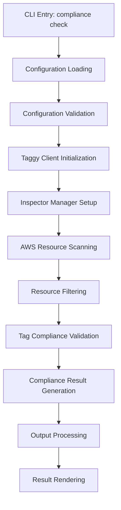
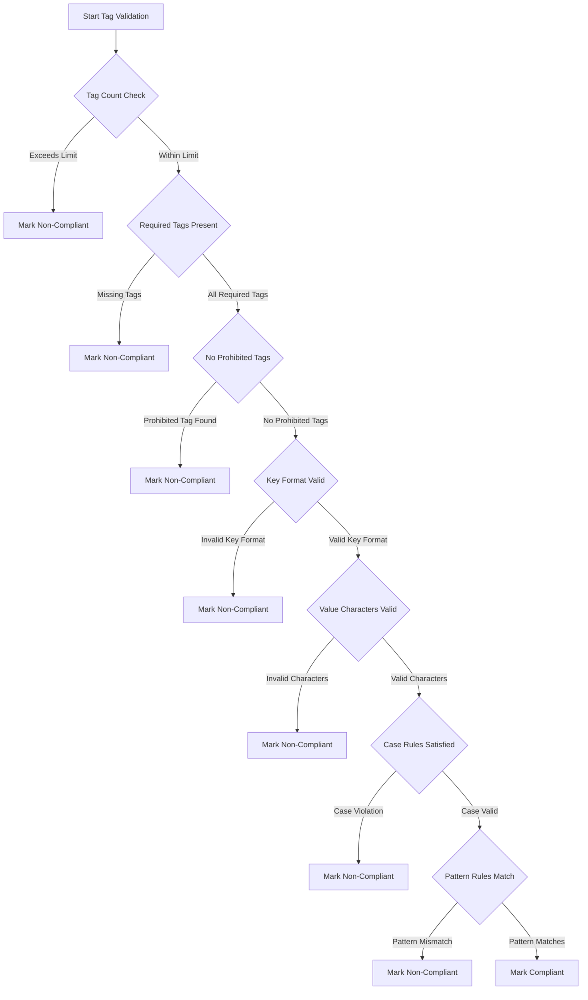

# AWS Taggy - Compliance Check Command Technical Flow

## Comprehensive Technical Overview

The `aws-taggy compliance check` command is a sophisticated tool for validating AWS resource tagging compliance, designed to provide organizations with a robust mechanism for enforcing tagging standards across their cloud infrastructure.

### Command Architecture and Design Principles

#### Core Objectives

- Validate AWS resource tagging against predefined compliance rules
- Provide comprehensive, configurable tag validation
- Support multi-service resource scanning
- Generate detailed compliance reports

### Technical Flow Diagram



### Detailed Technical Flow

#### 1. CLI Entry Point (`cli/cmd/compliance_check.go`)

**Command Structure:**

```go
type CheckCmd struct {
    Config     string // Path to tag compliance configuration
    Output     string // Output format (table, JSON, YAML)
    Table      bool   // Detailed table visualization
    Detailed   bool   // Granular resource-level results
    Clipboard  bool   // Copy results to clipboard
    OutputFile string // Write results to file
    Resource   string // Optional resource-specific filtering
}
```

**Key Responsibilities:**

- Parse command-line flags
- Validate input configuration
- Set up logging
- Manage output formats
- Initialize compliance check workflow

#### 2. Configuration Loading and Validation

**Configuration Processing Steps:**

1. Load configuration from YAML file
2. Validate configuration structure
3. Apply default validation rules
4. Prepare compliance parameters

**Validation Checks:**

- YAML structure integrity
- Required field presence
- Value constraints
- Compliance rule validity

#### 3. Tag Validator Initialization

**Validation Strategy:**

- Create validator with loaded configuration
- Prepare comprehensive validation rule set
- Initialize multi-dimensional compliance checking

#### Validation Decision Tree



#### 4. Inspector Manager and Resource Scanning

**Resource Discovery Process:**

- Create `InspectorManager` from configuration
- Set up service-specific resource scanners
- Perform parallel AWS API calls
- Collect resource metadata and tags
- Handle API errors and rate limiting

**Scanning Strategies:**

- Parallel resource discovery
- Pagination handling
- Error resilience
- Region-specific scanning

#### 5. Resource Filtering and Compliance Validation

**Filtering Capabilities:**

- Filter by resource ARN
- Filter by resource name
- Filter by resource type

**Validation Engine Components:**

- Required tag presence check
- Tag format validation
- Value constraint verification
- Case sensitivity checks
- Pattern matching

#### 6. Compliance Result Generation

**Result Processing:**

- Convert internal compliance results
- Generate compliance summary
- Track global violation statistics
- Prepare detailed resource-level results

**Summary Metrics:**

- Total resources scanned
- Compliant resources count
- Non-compliant resources count
- Violation type distribution

#### 7. Output Processing and Rendering

**Output Handling Strategies:**

- Structured output (JSON/YAML)
- Tabular display
- Clipboard copy
- File output
- Detailed resource-level view

### Compliance Levels

1. **High Compliance Level**

   - Strictest validation rules
   - Minimal tolerance for deviations
   - Comprehensive tag requirements

2. **Standard Compliance Level**

   - Balanced approach
   - Moderate constraints
   - Flexible yet structured

3. **Low Compliance Level**
   - Most relaxed validation
   - Minimal tag enforcement
   - Suitable for transitional environments

### Error Handling and Logging

**Error Management Strategies:**

- Contextual error wrapping
- Detailed error messages
- Logging via `pkg/o11y`
- Graceful error presentation

### Performance Considerations

**Optimization Techniques:**

- Parallel resource scanning
- Efficient memory management
- Batch processing
- Minimal AWS API calls
- Configurable scanning parameters

### Example Configuration

```yaml
tag_validation:
  required_tags:
    - environment
    - owner
    - cost_center

  compliance_level: standard

  key_format_rules:
    - pattern: "^[a-z][a-z0-9_-]*$"
      message: "Tag keys must start with lowercase and use alphanumeric characters"

  case_rules:
    environment:
      case: lowercase
      message: "Environment tags must be lowercase"

  pattern_rules:
    owner: "^[a-z0-9._%+-]+@company\\.com$"
```

### CLI Usage Example

```bash
# Comprehensive compliance check
aws-taggy compliance check \
    --config=tag-policy.yaml \
    --detailed \
    --output=json \
    --resource=arn:aws:ec2:us-west-2:123456789:instance/i-1234
```

### Best Practices

1. Maintain comprehensive YAML configurations
2. Regularly review and update tagging standards
3. Leverage compliance levels strategically
4. Monitor validation reports
5. Implement gradual rule enforcement

## Conclusion

The AWS Taggy `compliance check` command provides a powerful, flexible approach to AWS resource tag governance, enabling organizations to maintain infrastructure consistency and compliance through intelligent, configurable validation mechanisms.
